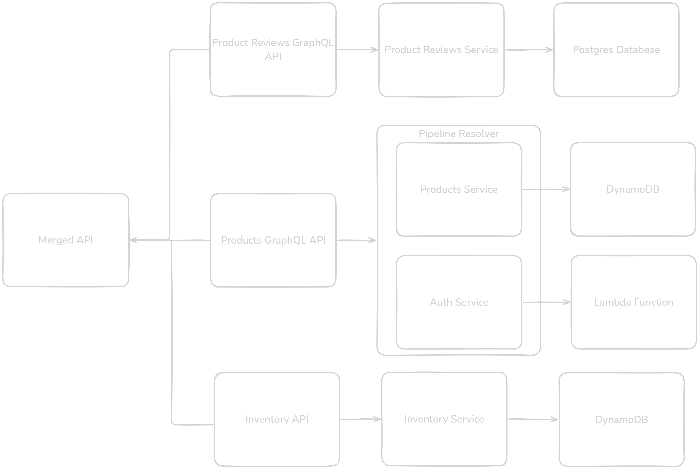

--- 
theme: default
class:
  - invert

---
# AWS AppSync GraphQL APIs


Link to GitHub repo with example code (https://github.com/TonySherman/wmaug-appsync-demo)


---
# GraphQL vs REST

- Strongly Typed Schema
- Reduce over fetching (or under fetching) data
- Single endpoint to serve your API
- Faster Iterations
    - Strict schema helps with this
    - You don't need to know how your backend implements the API

<!--
Won't cover AppSync Events or Subscriptions this talk
-->
---
# GraphQL on AWS

- Access a variety of Datasources (DynamoDB, RDS, OpenSearch, Lambda, Eventbridge, Etc.)
- Merge several APIs into a single source API 

<!--
Backend for Frontend (BFF) approach
-->
---
# AWS AppSync Components

## Schema

- Defines the shape of your data

```json
type Person {
    id: ID!
    name: String
    email: AWSEmail!
}

type Query {
    people: [Person]
    person(id: ID!): Person
}

type Mutation {
    addPerson(id: ID!, name: String, email: AWSEmail!): Person
    deletePerson(id: ID!): 
}
```
<!-- 
Walkthrough of AppSync Components:

A schema consists of Types and Fields

Types define your data
Fields are in the scope of types 

Query, Mutation, and Subscription are special types reserved by GraphQL

Query - think of your traditional GET requests
Mutation - modifies data (create, update, delete)
Subscription - real time, pub/sub style updates (not discussed today)
-->
___

# AWS AppSync Components

## Data sources

The actual data your are interacting with via your schema

- DynamoDB Table
- RDS Database
- OpenSearch
- HTTP APIs
- Lambda
- None Data source

<!--
AppSync provides several direct integrations with various
data sources to interact with.

In the case of an unsupported source, you can always drop in to a Lambda Function
-->
---
# AWS AppSync Components

## Resolvers

How to interact with your Data sources

- Unit/Direct Resolvers or Pipeline Resolvers
- JavaScript or VTL 

<!--
Resolvers are how you interact with your data sources

Sometimes you need to chain several interactions together into a pipeline Resolvers
 - Example (Request > Authz > Query > Response)

You can use APPSYNC_JS runtime or Apache Velocity Template Language (JS recommended)
-->
---
# Putting It All together


<a href="https://docs.aws.amazon.com/appsync/latest/devguide/data-source-components.html" target="_blank">Source</a>

---
# Demo Time

---

